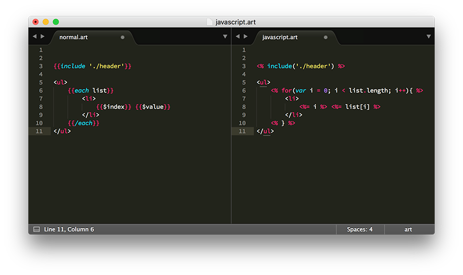

# sublime-art

art-template syntax definition for Sublime Text 3. Works with [art-template](https://aui.github.io/art-template) syntax. Also includes art-template tag autocompletion and some snippets.

> Requires Sublime Text 3 build >=3103

## Installation

1. [Download the .zip](https://github.com/aui/sublime-art/releases)
2. Unzip and rename folder to `art`
3. Copy folder into `Packages` directory, which you can find using the menu item `Preferences → Browse Packages...`

> Note: Don't forget to restart Sublime Text after installing this package.

## Preview

## Snippets

In the HTML scope:

+ `if`+`TAB` - Inserts art-template `if` statement
+ `each`+`TAB`- Inserts art-template `each` loop 
+ `for`+`TAB` - Inserts art-template `for` loop

## Thanks

[sublime-ejs](https://github.com/nwoltman/sublime-ejs)